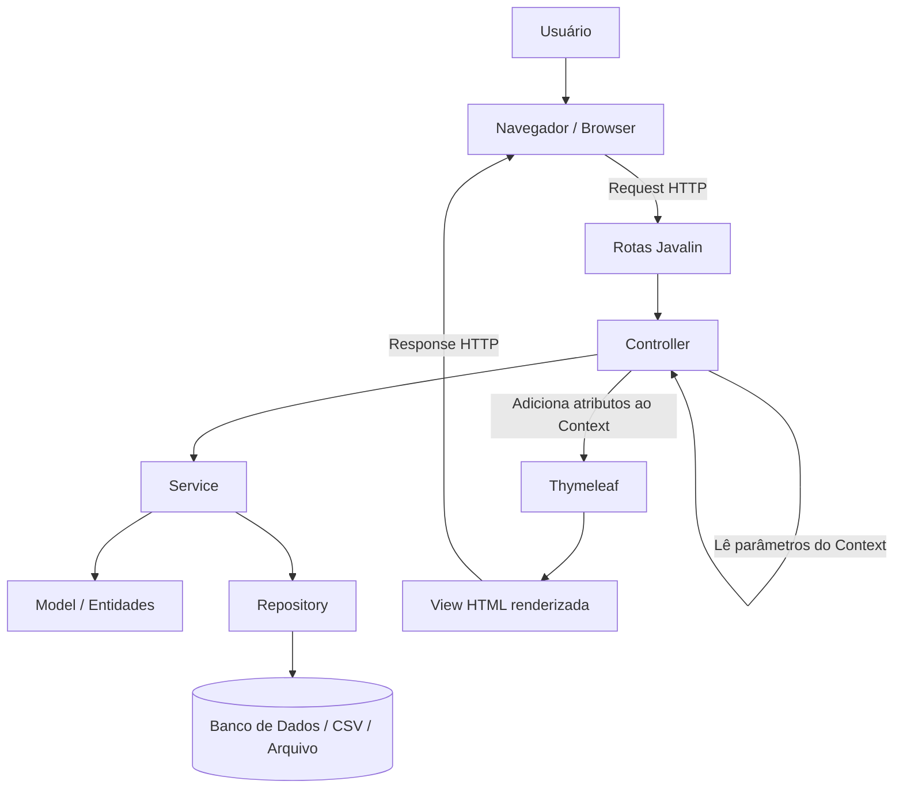

%%[🖋 Edit in Excalidraw](attachments/2026-05-18%20arquitetura%20web%202026-05-18%2008.33.38.excalidraw.md)%%

# Fichamento da Aula — 18 de Maio de 2026

**Disciplina:** APS 2026.1  
**Professor:** Rodrigo Rebouças  
**Tema central:** Aplicações web, arquitetura em camadas, Javalin, Thymeleaf, REST, server-side rendering, diagnóstico de incidentes e uso orientado de IA no desenvolvimento de software.

---

## 1. Contexto inicial da aula

A aula começou com a orientação para que os alunos instalassem e utilizassem o **Google Antigravity**, conectado ao Gemini, para abrir a atividade da semana anterior: uma aplicação web simples.

O professor pediu que os alunos abrissem o projeto, mas que ainda não começassem a programar. Antes da prática, ele retomou conceitos fundamentais vistos anteriormente.

Também reforçou que os alunos não devem passar uma semana sem mexer nas atividades, pois o conteúdo acumula e dificulta o acompanhamento da disciplina.

---

## 2. Revisão dos fundamentos de aplicações web

### 2.1 Protocolo HTTP

O professor retomou a ideia de que a internet utiliza protocolos de comunicação. Um protocolo foi definido como um **conjunto de regras** ou um **padrão de comunicação** entre computadores.

No contexto da web, o protocolo destacado foi o **HTTP**, usado na comunicação entre cliente e servidor.

### 2.2 Cliente e servidor

Na comunicação web:

- o **cliente** é, normalmente, o navegador usado pelo usuário;
- o **servidor** pode ser entendido como um programa ou serviço que escuta requisições na rede e responde a elas;
- esse programa servidor roda em algum computador, máquina virtual, container ou ambiente de nuvem.

Na fala da aula, o professor usou a ideia de servidor como um computador com um programa escutando a rede. Essa é uma boa simplificação inicial, mas é importante perceber que, em sistemas reais, “servidor” pode se referir tanto à máquina quanto ao software ou serviço que responde às requisições.

O professor explicou que programas rodam sobre sistemas operacionais, e os sistemas operacionais rodam sobre computadores.

Exemplos de sistemas operacionais mencionados:

- Linux;
- Windows;
- macOS;
- iOS;
- Android.

### 2.3 IP e identificação de computadores na rede

Foi explicado que, quando uma mensagem é enviada em uma rede, ela precisa chegar ao destino correto.

Na explicação inicial da aula, o professor simplificou esse processo dizendo que a mensagem é distribuída na rede local e que o computador correto identifica que a mensagem é sua. Essa explicação ajuda a introduzir a ideia de endereçamento, mas, tecnicamente, redes modernas usam mecanismos como IP, endereço MAC, switches e roteadores para encaminhar os dados.

A forma apresentada para endereçar um computador na rede foi o **IP**.

O IP identifica uma interface de rede em uma rede. Didaticamente, na aula, ele foi tratado como o endereço do computador na rede.

O professor destacou:

- o IP é usado para identificar o destino de uma comunicação na rede;
- o IP pode ser local ou remoto;
- alguns IPs não são roteáveis pela internet.

Exemplos citados:

- `127.0.0.1`: endereço local da própria máquina, conhecido como `localhost`;
- IPs iniciados por `192.168`: usados em redes locais;
- IPs iniciados por `10`: também usados em redes locais.

O professor usou como exemplo a rede do laboratório, em que os computadores seguem um padrão como `10.0.1.x`, associando o laboratório e o número da máquina.

---

## 3. Métodos HTTP

O professor relembrou os principais métodos HTTP usados em aplicações web:

- `GET`;
- `POST`;
- `PUT`;
- `DELETE`.

Também comentou que existem outros métodos HTTP, mas que esses são os mais importantes para a discussão inicial da disciplina.

### 3.1 GET

O `GET` é usado para **recuperar informações**.

Exemplos:

- pedir uma página;
- pedir uma imagem;
- pedir o arquivo `index`;
- recuperar os dados de uma entidade.

Exemplo em uma aplicação web:

```http
GET /alunos
```

Esse endpoint poderia retornar a lista de alunos.

Outro exemplo:

```http
GET /alunos/123
```

Esse endpoint poderia retornar os dados do aluno de identificador `123`.

### 3.2 POST

O `POST` é usado para **enviar dados ao servidor**, normalmente para criar um novo recurso ou submeter uma operação.

Exemplos:

- envio de formulário;
- criação de cadastro;
- upload de arquivo;
- envio de uma imagem para o servidor.

Na explicação oral, o professor usou um exemplo simplificado com `POST /aluno?id=123`. Esse exemplo ajuda a associar `POST` à criação, mas não é a forma mais adequada para ensinar a estrutura de uma API. Em uma aplicação típica, o ID de um novo recurso geralmente é gerado pelo próprio sistema, e os dados são enviados no corpo da requisição.

Exemplo mais adequado:

```http
POST /alunos
Content-Type: application/json

{
  "nome": "João da Silva",
  "matricula": "202600123",
  "email": "joao@dcx.ufpb.br"
}
```

Nesse caso:

- o cliente envia os dados do novo aluno;
- o servidor cria o aluno;
- o servidor pode gerar automaticamente o identificador do aluno;
- a resposta pode informar que o aluno foi criado.

Exemplo de resposta possível:

```http
HTTP/1.1 201 Created
Content-Type: application/json

{
  "id": 123,
  "nome": "João da Silva",
  "matricula": "202600123",
  "email": "joao@dcx.ufpb.br"
}
```

### 3.3 PUT

O `PUT` é usado para **atualizar um recurso existente**.

Exemplo:

```http
PUT /alunos/123
Content-Type: application/json

{
  "nome": "João da Silva",
  "matricula": "202600123",
  "email": "joao.silva@dcx.ufpb.br"
}
```

Nesse exemplo, o sistema atualiza os dados do aluno de identificador `123`.

Em muitas APIs, o `PUT` representa a substituição completa do recurso. Em outras situações, pode ser usado de forma mais flexível, dependendo das decisões da aplicação.

### 3.4 PATCH

Embora não tenha sido o foco da aula, é útil conhecer o `PATCH`.

O `PATCH` é usado para **atualizar parcialmente** um recurso.

Exemplo:

```http
PATCH /alunos/123
Content-Type: application/json

{
  "email": "novo.email@dcx.ufpb.br"
}
```

Nesse caso, apenas o e-mail do aluno seria alterado.

### 3.5 DELETE

O `DELETE` é usado para **remover um recurso**.

Exemplo:

```http
DELETE /alunos/123
```

Esse endpoint poderia remover o aluno de identificador `123`.

### 3.6 Outros métodos HTTP

Além dos métodos principais discutidos na aula, existem outros métodos HTTP. Dois exemplos importantes são:

- `HEAD`: parecido com `GET`, mas retorna apenas os cabeçalhos da resposta, sem o corpo;
- `OPTIONS`: usado para descobrir quais métodos ou opções estão disponíveis para determinado recurso.

Para a disciplina, o professor destacou que, inicialmente, basta compreender bem `GET` e `POST`, mas o entendimento de `PUT`, `PATCH`, `DELETE` e outros métodos ajuda a compreender APIs e sistemas web mais completos.

---

## 4. Separação de preocupações e domínio de negócio

### 4.1 Domínio de negócio

O professor retomou a importância de separar preocupações ao desenvolver um sistema.

Um **domínio de negócio** foi explicado como um conjunto de conceitos, entidades, relacionamentos e regras dentro de uma área de negócio ou área de conhecimento.

Exemplo usado: domínio bancário.

No domínio de um banco, existem conceitos como:

- conta corrente;
- correntista;
- saldo;
- regras de saque.

A regra de que uma pessoa não pode sacar mais dinheiro do que possui em conta foi apresentada como exemplo de **regra de negócio**.

### 4.2 Entidades

Uma entidade foi explicada como um conceito do domínio.

Exemplos de entidades:

- aluno;
- disciplina;
- turma;
- conta;
- correntista.

O professor explicou que entidades podem ser concretas ou abstratas.

### 4.3 Entidades concretas

Na explicação oral, o professor associou entidade concreta àquilo que “a gente vê, toca”. Essa explicação ajuda em um primeiro momento, mas precisa ser entendida de forma mais ampla em modelagem de software.

Em modelagem orientada a objetos, uma entidade concreta é aquela que pode ser **instanciada diretamente** no sistema. Ela pode representar algo físico, como uma pessoa, ou algo conceitual, como uma turma, desde que exista como objeto concreto no domínio modelado.

Exemplos discutidos:

- estudante/aluno;
- turma;
- pessoa física, dependendo do sistema.

Na orientação a objetos, conceitos concretos costumam ser implementados como **classes concretas**.

### 4.4 Entidades abstratas

Entidades abstratas foram explicadas como generalizações.

Exemplos discutidos:

- funcionário, quando existem professor e técnico administrativo;
- conta, quando existem conta corrente, conta pessoa física e conta pessoa jurídica;
- correntista, quando existem pessoa física e pessoa jurídica.

Na orientação a objetos, conceitos abstratos podem ser implementados como:

- classes abstratas;
- interfaces.

### 4.5 Generalização, herança e polimorfismo

O professor explicou que generalizações servem para reutilizar conceitos e lidar com diferentes tipos de objetos de maneira uniforme.

Exemplo:

- uma universidade pode lidar com o conceito geral de funcionário;
- professores e técnicos administrativos são tipos específicos de funcionário.

Outro exemplo:

- uma pessoa física chamada João pode ser correntista em um sistema bancário;
- o mesmo João pode ser aluno ou professor no SIGAA;
- o mesmo conceito concreto pode ser abstraído de formas diferentes em domínios diferentes.

O professor relacionou essa discussão com conceitos já vistos em orientação a objetos, como **herança** e **polimorfismo**, agora pensados no contexto de design de sistemas.

---

## 5. Front-end e back-end

### 5.1 Front-end

O front-end foi explicado como a parte do sistema com a qual o usuário interage.

Exemplos mencionados:

- página web;
- interface gráfica de aplicativo de celular;
- interface gráfica de sistema operacional, como janelas do Windows.

O professor destacou que o front-end também possui código-fonte, como em aplicações feitas com:

- JavaScript;
- HTML;
- CSS;
- ReactJS.

### 5.2 Back-end

O back-end foi associado às partes do sistema responsáveis por:

- regras de negócio;
- modelos;
- funcionalidades;
- comunicação com mecanismos de persistência, como banco de dados ou arquivos.

É importante observar que o banco de dados não é exatamente “o back-end”. Ele é uma tecnologia de persistência acessada pelo back-end.

### 5.3 Front-end e back-end não são domínio de negócio

Front-end e back-end não são domínios de negócio. Eles são áreas técnicas ou partes arquiteturais do sistema.

O domínio de negócio está relacionado aos conceitos e regras do problema que o sistema resolve. Já front-end e back-end dizem respeito à forma como a solução técnica é organizada.

### 5.4 Por que separar front-end e back-end?

A separação permite:

- reutilizar o mesmo back-end com diferentes front-ends;
- manter uma interface web e uma interface mobile acessando os mesmos dados;
- facilitar a manutenção;
- localizar melhor onde está um problema.

Exemplo utilizado:

Um banco pode ter um aplicativo de celular e um site. Ambos exibem o mesmo saldo porque acessam o mesmo back-end.

O professor explicou que, se houver um problema no formulário do usuário, provavelmente o desenvolvedor investigará o front-end. Se houver um problema relacionado às regras ou à persistência, a investigação será no back-end.

---

## 6. Arquitetura do back-end

### 6.1 Requisição do navegador ao servidor

O professor retomou o cenário básico:

- o usuário acessa o sistema por um navegador;
- o navegador faz uma requisição HTTP;
- a requisição chega ao servidor;
- o servidor processa a requisição e responde.

A partir desse ponto, o professor apresentou conceitos usados para organizar as responsabilidades dentro do servidor.

### 6.2 Controller

O **controller** foi definido como o código responsável por tratar a requisição.

Ele recebe a requisição HTTP e decide o que fazer com ela.

Exemplo usado:

No cadastro de aluno, o sistema pode ter:

- `AlunoController`;
- `AlunoService`.

O `AlunoController` recebe as informações vindas do formulário, como:

- matrícula;
- nome;
- CPF.

Depois, chama o serviço apropriado para executar a regra de negócio.

### 6.3 Service

O **service** foi apresentado como a camada responsável por manipular as regras de negócio.

O controller usa o service para executar ações do sistema.

Exemplo:

- o controller chama uma ação `cadastrarAluno` no service;
- o service decide como cadastrar o aluno.

O professor destacou que o service encapsula a forma como o sistema lida com a entidade.

### 6.4 Repository

O **repository** foi explicado como a entidade responsável por armazenar ou recuperar informações.

Ele pode lidar com:

- banco de dados;
- arquivo CSV;
- outro mecanismo de persistência.

O service interage com o repository quando precisa salvar ou buscar dados.

### 6.5 Model

O **model** foi apresentado como o modelo de negócio do sistema.

Ele contém as entidades relacionadas ao domínio.

Exemplo:

- a classe `Aluno` ficaria no model.

---

## 7. Arquitetura como estrutura acima do código

O professor explicou que arquitetura é a estrutura do sistema em um nível acima do código.

Exemplos de nível de código:

- classe `Aluno`;
- classe `Professor`;
- classe `Turma`.

Exemplos de nível arquitetural:

- módulo;
- camada;
- sistema;
- escolha de linguagem;
- escolha de framework.

Foi feita uma analogia com construção civil:

- os tijolos seriam como o código;
- as paredes e a estrutura da construção seriam como a arquitetura.

A escolha da linguagem de programação foi apresentada como decisão arquitetural, pois influencia a estrutura da solução.

Exemplos de decisões arquiteturais:

- usar Java;
- usar Spring Boot;
- usar ReactJS;
- usar Javalin;
- estruturar o back-end em controller, service, repository e model.

---

## 8. MVC, camadas e organização da aplicação

O professor usou a ideia de uma organização próxima de uma arquitetura MVC clássica, mas combinada com camadas adicionais comuns em aplicações web, como service e repository.

Portanto, no contexto da aula, é melhor entender a arquitetura como uma aplicação web organizada em responsabilidades:

- **View**: páginas HTML processadas pelo Thymeleaf;
- **Controller**: recebe requisições HTTP e coordena a resposta;
- **Service**: concentra regras de negócio e operações da aplicação;
- **Repository**: acessa dados em banco, CSV ou outro mecanismo de persistência;
- **Model**: representa entidades e conceitos do domínio.

### 8.1 Diagrama de uma aplicação web típica da aula



### 8.2 Por que usar controller, service, repository e model?

O professor explicou que muitos frameworks de back-end usam estruturas parecidas, mesmo em linguagens diferentes.

Exemplos citados:

- Java;
- Python;
- JavaScript.

A razão para usar conceitos conhecidos é facilitar a compreensão por outros desenvolvedores.

Se um desenvolvedor vê uma pasta ou classe chamada `controller`, ele já entende que ali estão as requisições. Se vê um `service`, entende que ali estão regras de negócio ou serviços da aplicação.

### 8.3 Manutenção

A separação ajuda a encontrar o local correto para modificar ou corrigir o sistema.

Exemplos:

- problema em formulário ou requisição: olhar o controller;
- problema de banco de dados: olhar o repository;
- novo atributo na entidade aluno: alterar model e também outros pontos relacionados, como repository, controller e formulário.

### 8.4 Software que dura mais tempo

O professor destacou que essa estrutura pode parecer complicada, mas ela se justifica quando o software precisa durar por mais de uma geração de desenvolvedores.

Para sistemas muito pequenos ou descartáveis, essa complexidade pode não ser necessária.

### 8.5 Redução de acoplamento

O professor enfatizou que o controller não deve acessar diretamente o banco de dados.

A ideia é reduzir acoplamento:

- o controller trata a requisição;
- o service executa a regra de negócio;
- o repository cuida da persistência.

Ao chamar um service, o controller não precisa saber se a informação vem de banco de dados, arquivo ou outro serviço.

### 8.6 Exemplo do serviço de pagamento

Foi usado o exemplo de um `PagamentoService`.

Nesse caso, o service pode não se comunicar com um repository, mas sim com um serviço externo de pagamento.

Exemplos mencionados:

- Mercado Pago;
- intermediadores entre bandeiras, bancos e aplicação;
- Master;
- Visa.

O professor explicou que esse tipo de comunicação também ocorre pela internet, usando HTTP e padrões como REST.

---

## 9. REST

### 9.1 O que é REST

REST foi apresentado como um padrão construído sobre HTTP.

A ideia central apresentada foi usar os verbos do HTTP para organizar operações sobre recursos do sistema.

Em uma API REST, normalmente pensamos em **recursos**. Um recurso pode ser, por exemplo:

- aluno;
- professor;
- disciplina;
- usuário;
- pedido;
- produto.

Cada recurso pode ser acessado por um caminho, também chamado de endpoint.

Exemplos:

```text
/alunos
/alunos/123
/professores
/professores/45
```

### 9.2 Endpoint

Um **endpoint** é um ponto de acesso da aplicação.

Ele combina:

- um caminho, como `/alunos/123`;
- um método HTTP, como `GET`, `POST`, `PUT` ou `DELETE`;
- uma ação esperada no servidor.

O mesmo caminho pode ter comportamentos diferentes dependendo do método HTTP usado.

### 9.3 Exemplos corrigidos de operações REST

#### Listar alunos

```http
GET /alunos
```

Recupera a lista de alunos.

#### Buscar um aluno específico

```http
GET /alunos/123
```

Recupera o aluno de identificador `123`.

#### Criar um novo aluno

```http
POST /alunos
Content-Type: application/json

{
  "nome": "Maria Julia Barbosa",
  "matricula": "202600456",
  "email": "maria.julia@dcx.ufpb.br"
}
```

Cria um novo aluno. O identificador normalmente é gerado pelo servidor.

#### Atualizar um aluno existente

```http
PUT /alunos/123
Content-Type: application/json

{
  "nome": "Maria Julia Barbosa de Freitas",
  "matricula": "202600456",
  "email": "maria.julia@dcx.ufpb.br"
}
```

Atualiza os dados do aluno `123`.

#### Atualizar parcialmente um aluno

```http
PATCH /alunos/123
Content-Type: application/json

{
  "email": "maria.freitas@dcx.ufpb.br"
}
```

Atualiza apenas parte dos dados do aluno `123`.

#### Remover um aluno

```http
DELETE /alunos/123
```

Remove o aluno `123`.

### 9.4 Relação entre HTTP, REST e CRUD

Uma forma comum de relacionar os verbos HTTP com CRUD é:

| Operação CRUD | Método HTTP comum | Exemplo |
|---|---|---|
| Create | `POST` | `POST /alunos` |
| Read | `GET` | `GET /alunos` ou `GET /alunos/123` |
| Update | `PUT` ou `PATCH` | `PUT /alunos/123` ou `PATCH /alunos/123` |
| Delete | `DELETE` | `DELETE /alunos/123` |

O professor apresentou REST como um bônus da aula e deixou claro que o conteúdo será aprofundado em outro momento ou em outras disciplinas. Ainda assim, a noção inicial ajuda a entender como sistemas se comunicam pela web.

---

## 10. JSON

O professor apresentou JSON como um formato amplamente usado na internet para troca de dados.

JSON é um formato textual inspirado na notação de objetos do JavaScript, mas hoje é usado de forma independente por diversas linguagens e sistemas.

Ele comparou JSON com XML.

### 10.1 XML

XML usa tags, por exemplo:

```xml
<aluno>
  <nome>João da Silva</nome>
  <matricula>202600123</matricula>
  <email>joao@dcx.ufpb.br</email>
</aluno>
```

O professor destacou que XML é mais verborrágico, pois usa muitos caracteres para representar a estrutura dos dados.

### 10.2 JSON

JSON representa dados usando pares de chave e valor.

Exemplo:

```json
{
  "id": 123,
  "nome": "João da Silva",
  "matricula": "202600123",
  "email": "joao@dcx.ufpb.br",
  "ativo": true
}
```

Também é possível representar listas:

```json
[
  {
    "id": 123,
    "nome": "João da Silva",
    "matricula": "202600123"
  },
  {
    "id": 124,
    "nome": "Maria Julia Barbosa",
    "matricula": "202600456"
  }
]
```

O professor orientou os alunos a procurarem exemplos de JSON depois, destacando que não é algo complicado, mas um padrão importante de entender.

---

## 11. Estrutura do projeto da atividade

O professor abriu a semente da atividade, um sistema web simples que ainda possui falhas, mas já está separado seguindo uma arquitetura padrão.

Foram identificados componentes como:

- `LoginController`;
- `UsuarioController`;
- `Usuario` no model;
- `UsuarioRepository`;
- `UsuarioService`.

### 11.1 Organização por conceito

O projeto foi organizado por conceito.

Por exemplo, dentro do conceito de login ou usuário, existem as partes relacionadas:

- controller;
- model;
- repository;
- service.

O professor explicou que alguns projetos fazem o inverso: colocam todos os controllers em uma pasta, todos os models em outra, todos os repositories em outra, e assim por diante.

Ele comentou que, quando o projeto cresce, prefere organizar por conceito, porque a manutenção normalmente acontece pensando no conceito.

Exemplo:

Se o desenvolvedor quiser alterar aluno, ele encontra juntos:

- controller de aluno;
- repository de aluno;
- service de aluno;
- model de aluno.

### 11.2 Criação de novo conceito

Para criar um novo conceito, o aluno deve criar um novo pacote.

Exemplos sugeridos:

- `professor`;
- `aluno`;
- `disciplina`.

Dentro desse pacote, deve criar subpacotes seguindo o padrão do projeto, como:

- `controllers`;
- `models`;
- `repositories`;
- `services`.

---

## 12. Rotas no Javalin

O professor explicou que os controllers são os lugares onde se recebe a requisição HTTP.

No arquivo principal da aplicação, ocorre o mapeamento entre URL e método.

Esse mapeamento foi chamado de **rota**.

Uma rota associa:

- uma URL;
- um método HTTP;
- uma classe ou método que será executado.

O professor destacou que todo framework web possui rotas. Alguns exigem que o desenvolvedor escreva as rotas explicitamente; outros podem gerar as rotas automaticamente a partir de padrões.

### 12.1 Javalin e Servlet

O professor explicou que o projeto usa **Javalin**.

O Javalin foi descrito como uma camada pequena sobre a arquitetura de Servlet do Java.

O Servlet foi apresentado como uma unidade básica da arquitetura web em Java que recebe requisições.

A escolha do Javalin foi justificada porque a disciplina está discutindo projeto de software. Com Javalin, os alunos precisam construir mais explicitamente a estrutura, em vez de apenas seguir uma estrutura já definida por um framework maior, como Spring Boot.

### 12.2 A metáfora de “construir o Spring Boot”

O professor usou a expressão “construir o Spring Boot” como metáfora didática.

A ideia não é que a turma esteja implementando literalmente um framework equivalente ao Spring Boot. A metáfora significa que os alunos estão construindo manualmente algumas estruturas e decisões que frameworks maiores normalmente já trazem prontas.

Assim, quando os alunos usarem Spring Boot ou outro framework no futuro, reconhecerão conceitos como:

- rotas;
- controllers;
- services;
- repositories;
- models;
- tratamento de requisições;
- renderização de respostas.

---

## 13. Formulário HTML, controller e contexto

### 13.1 Formulário de usuário

O professor mostrou um formulário HTML de cadastro de usuário.

No formulário, havia campos como:

- nome;
- e-mail;
- senha.

O formulário enviava os dados para `/usuarios` usando o método `POST`.

Exemplo conceitual:

```html
<form action="/usuarios" method="post">
  <input type="text" id="nome" name="nome">
  <input type="email" id="email" name="email">
  <input type="password" id="senha" name="senha">
</form>
```

### 13.2 Recebimento no controller

No `UsuarioController`, os dados enviados pelo formulário são recuperados a partir do contexto.

O professor explicou que o Javalin recebe a requisição, mapeia `/usuarios` para o método adequado e injeta um objeto de contexto.

Esse objeto `context` contém as informações da requisição.

Exemplo conceitual:

```java
String nome = context.formParam("nome");
String email = context.formParam("email");
String senha = context.formParam("senha");
```

O professor explicou que, quando se chama `formParam`, o código está tirando informações de dentro do contexto.

### 13.3 Validação de usuário existente

O professor mostrou que o controller chama o service para verificar se já existe um usuário com o e-mail informado.

Se já existir, o código adiciona uma mensagem de erro ao contexto e renderiza novamente o formulário.

Exemplo conceitual:

```java
context.attribute("erro", "Já existe um usuário com esse e-mail");
context.render("/login/formulario-usuario.html");
return;
```

### 13.4 Contexto como transporte de informações

O professor explicou que o contexto funciona como uma espécie de “bolsa” que carrega informações.

Ele contém dados vindos da requisição e também pode receber novas informações que serão usadas na resposta.

Exemplo:

- o formulário envia nome, e-mail e senha;
- o controller recupera esses dados;
- o controller adiciona uma mensagem de erro ao contexto;
- o contexto é usado para renderizar novamente a página.

---

## 14. Thymeleaf

O professor explicou que o projeto usa Thymeleaf para processar HTML no servidor.

No formulário, ele mostrou atributos HTML com prefixo `th`, como `th:if` e `th:text`.

Esses elementos não são tags próprias do HTML. Tecnicamente, `th:if` e `th:text` são **atributos processados pelo Thymeleaf**.

Exemplo conceitual:

```html
<div th:if="${erro}" th:text="${erro}"></div>
```

Esse trecho significa:

- se existir a variável `erro` no contexto, exiba a `div`;
- o texto da `div` será o conteúdo da variável `erro`.

O professor explicou que a variável `erro` foi colocada no contexto pelo controller. Quando o Thymeleaf processa a página, ele verifica se essa variável existe e exibe a mensagem correspondente.

---

## 15. Request, response e renderização

O professor explicou o fluxo:

1. O navegador envia uma requisição HTTP.
2. O servidor recebe a requisição.
3. O Javalin mapeia a rota para o método adequado.
4. O controller acessa o contexto.
5. O controller pode chamar o service.
6. O controller pode adicionar atributos ao contexto.
7. O servidor renderiza uma página.
8. O servidor envia uma resposta HTTP ao navegador.

O professor diferenciou:

- **request**: a requisição que chega ao servidor;
- **response**: a resposta enviada de volta ao navegador.

No exemplo, a resposta era a página de formulário processada com a mensagem de erro.

---

## 16. Server-side rendering

### 16.1 Conceito

O professor explicou que, no projeto da disciplina, a página é renderizada no servidor.

Esse modelo foi chamado de **server-side rendering**.

Nesse modelo:

- o navegador envia uma requisição;
- o servidor processa a requisição;
- o servidor envia uma nova página HTML completa;
- o navegador substitui a página anterior pela nova.

### 16.2 Consequência

O professor observou que, mesmo quando seria necessário retornar apenas uma informação pequena, como uma mensagem de erro, o servidor envia a página inteira novamente.

Isso pode gerar processamento e tráfego desnecessários.

### 16.3 Quando isso é um problema?

Segundo o professor, depende da escala.

Para sistemas com poucos usuários e páginas simples, server-side rendering pode ser suficiente. O impacto depende de fatores como:

- volume de usuários;
- quantidade de interações;
- tamanho das páginas;
- infraestrutura disponível;
- quantidade de processamento no servidor;
- acesso a banco de dados ou arquivos.

### 16.4 Comparação com web applications modernas

O professor comparou com aplicações web modernas, em que a aplicação é carregada no navegador.

Nessas aplicações:

- a página ou aplicação principal é carregada no browser;
- a navegação pode acontecer no próprio navegador;
- o servidor é chamado para retornar apenas dados, geralmente em JSON;
- o JavaScript atualiza a interface.

O professor destacou que frameworks web modernos funcionam dessa maneira, mas isso não é o objeto principal da disciplina.

A opção por server-side rendering foi feita para reduzir o overhead cognitivo dos alunos, evitando que eles precisem aprender JavaScript, front-end moderno e back-end ao mesmo tempo.

---

## 17. Incidente real: bloqueio de acesso por IP

O professor relatou um incidente ocorrido em uma loja da Alê Pessoa.

### 17.1 Situação

No sábado pela manhã, a equipe informou que não conseguia acessar o sistema.

O professor verificou que:

- o sistema estava funcionando em seu computador;
- o monitoramento estava verde;
- outras lojas conseguiam acessar;
- apenas a loja principal, no Miramar, não conseguia acessar.

### 17.2 Diagnóstico inicial

Como o problema ocorria apenas em uma rede específica, a hipótese inicial foi um problema de rede ou bloqueio por firewall.

O professor explicou que firewall é um mecanismo que pode bloquear acessos, inclusive por IP.

Foi identificado que o IP externo da loja do Miramar estava bloqueado.

### 17.3 Resolução do incidente

O professor explicou a diferença entre resolver o incidente e descobrir sua causa.

Quando há um incidente, o primeiro objetivo é apagar o fogo. Depois, investiga-se a causa.

A solução aplicada foi mudar o IP externo da loja.

Como a empresa tinha duas conexões de internet, a equipe entrou em contato com o responsável pelo serviço de rede. Ele acessou remotamente e desligou a conexão principal, ativando a conexão secundária.

Com a conexão secundária, o IP público mudou e o sistema voltou a funcionar.

### 17.4 Investigação posterior

Mesmo após o retorno do sistema, o professor destacou que ainda era necessário descobrir a causa do bloqueio.

Uma hipótese apresentada foi comportamento anômalo ou excesso de requisições.

Possíveis causas mencionadas:

- vírus;
- bug;
- problema gerando muitas requisições;
- uso simultâneo de várias máquinas;
- aplicação fazendo requisições demais em um fluxo normal.

---

## 18. WAF — Web Application Firewall

O professor apresentou o conceito de **WAF**, sigla para **Web Application Firewall**.

Um firewall ou WAF pode ser implementado como dispositivo, software ou serviço. O WAF atua especificamente na camada da aplicação web, analisando requisições HTTP e podendo bloquear comportamentos considerados suspeitos.

O WAF foi descrito como um mecanismo de segurança que monitora as requisições que chegam ao servidor.

Se um IP fizer muitas requisições por segundo, o WAF pode bloquear esse IP.

No incidente relatado, o WAF bloqueou o IP porque, em determinado momento, houve mais requisições por segundo do que o limite configurado.

O professor mencionou valores como 30, 40 ou 60 requisições por segundo como exemplos de limites.

Depois, a equipe aumentou o limite para suportar mais requisições e continuou avaliando o comportamento do sistema.

---

## 19. Ferramentas de desenvolvedor do navegador

O professor mostrou o uso da ferramenta **Inspect** do navegador, descrevendo-a como o melhor amigo do desenvolvedor web.

Ele destacou a aba **Network**, que permite observar as requisições feitas por uma página.

### 19.1 Cada linha no Network é uma requisição

Na aba Network, cada linha do log representa uma requisição feita pelo navegador.

Essas requisições podem envolver:

- HTML;
- imagens;
- scripts JavaScript;
- arquivos CSS;
- fontes;
- chamadas assíncronas;
- dados carregados sob demanda;
- recursos externos.

### 19.2 Exemplo de página com muitas requisições

O professor abriu uma página de notícias e mostrou que, conforme a página carregava e o usuário rolava a tela, novas requisições eram feitas.

Foram observados números como:

- mais de 500 requisições;
- mais de 600 requisições;
- aproximadamente 691 requisições;
- transferência de dezenas de megabytes.

O professor explicou que a rolagem da página pode disparar novas requisições por meio de técnicas como lazy loading.

### 19.3 Estimativa de carga

O professor explicou que, para estimar quanto um servidor aguenta, não basta contar usuários.

É preciso considerar:

- número de usuários;
- quantidade de interações;
- quantidade de requisições geradas por página ou fluxo;
- volume de dados transferidos.

Exemplo apresentado:

Se 1.000 usuários acessam por minuto uma página que gera cerca de 700 requisições, o sistema pode receber aproximadamente 700.000 requisições.

O professor também observou que, em páginas reais, parte das requisições pode ir para servidores diferentes.

---

## 20. Atividade prática em sala

### 20.1 Primeira atividade

O professor pediu que os alunos acrescentassem uma nova entidade ao sistema.

O sistema possuía login e usuário. Os alunos deveriam criar outro conceito, como:

- aluno;
- professor;
- disciplina.

### 20.2 Fazer primeiro manualmente

A orientação foi fazer primeiro “na mão”, sem pedir para a IA gerar tudo.

O objetivo era sentir a dor de codificar e entender a estrutura.

O aluno deveria criar:

- novo model;
- novo controller;
- novo service;
- novo repository;
- novos elementos necessários para a entidade escolhida.

O professor destacou que havia muito reaproveitamento do exemplo existente, com bastante `Ctrl+C` e `Ctrl+V`, mas que era importante entender a estrutura.

### 20.3 Dificuldade principal

Após a prática, o professor comentou que a maior dificuldade da atividade não era a codificação em si, mas decidir como relacionar a nova entidade escolhida com a entidade `Usuario` já existente.

Alguns alunos usaram herança, fazendo a nova entidade herdar de usuário.

---

## 21. Exercício para casa com Inteligência Artificial

O professor pediu que os alunos fizessem um exercício em casa até a próxima segunda-feira.

A orientação foi usar uma ferramenta de IA que programe com agentes, como:

- Google Antigravity;
- Codex;
- GitHub Copilot;
- outras ferramentas disponíveis.

### 21.1 Objetivo do exercício

Os alunos devem pedir para a IA implementar uma aplicação semelhante à da aula, começando do zero.

A aplicação deve ter:

- login e senha;
- CRUD de professor;
- CRUD de aluno;
- estrutura semelhante à trabalhada em sala.

### 21.2 Como orientar a IA

O professor alertou que o aluno não deve começar o prompt apenas dizendo o requisito funcional.

Exemplo inadequado:

```text
Crie um sistema para cadastrar, listar, editar e remover alunos e professores.
```

Segundo o professor, se o aluno fizer apenas isso, a IA até implementará, mas sem garantia de:

- linguagem de programação;
- framework;
- estrutura do código;
- arquitetura desejada;
- separação adequada de responsabilidades.

### 21.3 Começar pelo projeto

O professor explicou que, ao iniciar um projeto com IA, é preciso começar pelo projeto.

O aluno deve especificar decisões como:

- usar Java;
- usar Javalin no back-end;
- usar Thymeleaf no front-end;
- estruturar o back-end segundo uma organização inspirada em MVC, combinada com camadas de service e repository;
- criar controllers;
- criar services;
- criar repositories;
- criar entidades de model.

Também deve declarar regras arquiteturais.

Exemplo de regra:

```text
Nunca um controller deve acessar diretamente o banco de dados. O banco de dados deve ser usado apenas pelo repository.
```

### 21.4 Começar pequeno

Depois das orientações arquiteturais, o professor sugeriu começar com algo pequeno, como:

- uma página simples;
- um login;
- armazenamento inicial em arquivo CSV.

Depois, o sistema pode evoluir.

---

## 22. Banco de dados

O professor comentou que os alunos de DSI já podem usar banco de dados.

A parte de banco de dados será conduzida com o apoio de IA.

Para a próxima segunda-feira, o professor orientou que os alunos estudem pelo menos:

- o que é um banco de dados;
- o que é uma tabela;
- como criar uma tabela;
- o comando `CREATE TABLE`.

Ele afirmou que, mesmo sem saber banco de dados, é possível aprender a fazer um `CREATE TABLE` com algumas horas de estudo.

Também comentou que, com quatro a seis horas de estudo, seria possível fazer quase um curso básico de banco de dados.

---

## 23. Testes automáticos

O professor destacou que, ao orientar a IA, o aluno deve pedir que tudo que for implementado tenha teste.

A regra sugerida foi:

- toda funcionalidade desenvolvida deve ser acompanhada de um teste automático;
- todo código implementado deve ter teste correspondente.

Testes automáticos funcionam como uma forma de **especificação executável**. Eles ajudam a indicar se a IA alterou algum comportamento esperado ao modificar o código.

Quando a IA tenta modificar algo e quebra um teste, ela recebe uma indicação de que precisa corrigir ou voltar atrás.

Os testes foram apresentados como um contexto fantástico para a IA.

---

## 24. Implementar back-end e front-end juntos

Outra orientação importante foi pedir à IA que implemente back-end e front-end ao mesmo tempo, para cada funcionalidade pequena.

O professor relatou uma experiência em que deixou a IA implementar bastante coisa no back-end, mas depois percebeu que não havia telas correspondentes.

Ao tentar implementar o front-end depois, aumentou a chance de inconsistências e alucinações.

### 24.1 Exemplo de inconsistência

Se no back-end a entidade professor tem atributos:

- `nome`;
- `matricula`.

A IA pode, ao implementar o front-end depois, usar nomes diferentes, como:

- `name`;
- `id`;
- `Nome` com inicial maiúscula.

Isso gera inconsistência entre front-end e back-end.

### 24.2 Contexto e redução de alucinação

O professor explicou que a IA alucina e gera conteúdo. Para reduzir alucinação, é necessário fornecer contexto.

Implementar back-end e front-end juntos ajuda porque a IA mantém na memória os nomes e decisões recém-criados.

---

## 25. Arquitetura, acoplamento e IA

O professor explicou que boa arquitetura também ajuda a IA a trabalhar melhor.

Se o código está separado em:

- controller;
- service;
- repository;
- model;

então a IA pode focar apenas na parte relevante.

Exemplo:

Se o problema está relacionado ao banco de dados, a IA pode receber o contexto do repository, sem precisar carregar toda a aplicação.

Isso reduz:

- acoplamento;
- risco de alucinação;
- quantidade de tokens;
- custo de uso da IA;
- dificuldade de manutenção.

O professor comparou isso a evitar código macarrônico, em que tudo fica misturado e difícil de entender.

---

## 26. Código pequeno, classes pequenas e custo de tokens

O professor orientou que, ao desenvolver uma solução, deve-se tentar minimizar o código necessário.

Boas práticas mencionadas:

- código pequeno;
- métodos pequenos;
- classes pequenas;
- separação clara de responsabilidades.

Código menor, mais modular e com responsabilidades bem separadas reduz a quantidade de contexto que precisa ser enviada à IA. Isso diminui custo, melhora o foco e reduz a chance de alterações indevidas.

O professor comentou sobre uma classe principal com quase 6.000 linhas em um código que estava desenvolvendo.

O problema é que, sempre que a IA precisava trabalhar em algo relacionado, era necessário carregar muitas linhas como contexto.

Isso aumenta o custo, porque código vira token, e token vira dinheiro.

O professor observou que carregar muitas linhas pode dar contexto à IA, mas também gera custo e torna a manutenção pior.

---

## 27. Prompt para iniciar um projeto com IA

O prompt abaixo reúne as orientações dadas pelo professor para iniciar o desenvolvimento de um sistema do zero com apoio de IA.

Ele deve ser usado pelos alunos antes de pedir funcionalidades específicas.

```text
Quero iniciar o desenvolvimento de uma aplicação web do zero.

Antes de implementar funcionalidades, siga as decisões arquiteturais e técnicas abaixo.

Tecnologias obrigatórias:
- Linguagem: Java.
- Framework web: Javalin.
- Renderização de páginas: Thymeleaf.
- Front-end: HTML processado no servidor com Thymeleaf.
- Persistência inicial: arquivo CSV ou banco de dados, conforme eu solicitar depois.

Organização arquitetural:
- Estruture a aplicação usando uma organização inspirada em MVC, combinada com camadas de service e repository.
- Cada conceito principal do domínio deve ter seu próprio pacote.
- Dentro de cada pacote de conceito, organize o código em:
  - controllers;
  - models;
  - services;
  - repositories.

Regras de responsabilidade:
- Controllers devem receber e tratar requisições HTTP.
- Controllers podem ler parâmetros do contexto do Javalin.
- Controllers podem adicionar atributos ao contexto para renderização no Thymeleaf.
- Controllers não podem acessar diretamente banco de dados, CSV ou qualquer mecanismo de persistência.
- Services devem concentrar as regras de negócio.
- Repositories devem concentrar o acesso a dados.
- Models devem representar entidades e conceitos do domínio.
- Views devem ser páginas HTML com atributos Thymeleaf, como th:if e th:text.

Regras de qualidade:
- Use código simples, pequeno e legível.
- Prefira métodos pequenos.
- Prefira classes pequenas.
- Evite código duplicado desnecessário.
- Evite código macarrônico.
- Mantenha baixo acoplamento entre as partes do sistema.
- Não misture regra de negócio com código de interface.
- Não misture regra de negócio com código de persistência.

Uso de testes:
- Toda funcionalidade implementada deve vir acompanhada de testes automáticos.
- Os testes devem verificar os comportamentos esperados da funcionalidade.
- Antes de concluir uma tarefa, execute ou indique como executar os testes.

Forma de implementação:
- Implemente o sistema de forma incremental.
- Para cada funcionalidade pequena, implemente back-end e front-end juntos.
- Não implemente todo o back-end primeiro para só depois implementar o front-end.
- Ao criar campos no model, use os mesmos nomes de forma consistente no controller, service, repository, templates e testes.

Primeiro passo:
- Crie apenas a estrutura inicial do projeto.
- Crie uma página inicial simples.
- Crie as rotas básicas no Javalin.
- Configure o Thymeleaf.
- Adicione um teste simples que confirme que a aplicação inicial funciona.
- Não implemente ainda CRUD completo.

Depois que terminar esse primeiro passo, explique:
- quais arquivos foram criados;
- qual é a responsabilidade de cada parte;
- como executar a aplicação;
- como executar os testes.
```

---

## 28. Encerramento da aula

Ao final, o professor reforçou que os alunos precisam aprender a desenvolver software com bom design e boa arquitetura.

Segundo ele, sem esse conhecimento, a IA pode gerar soluções misturadas, cheias de gambiarra e difíceis de manter.

A mensagem final foi que a turma seguirá nessa direção: aprender arquitetura, design e uso orientado de IA no desenvolvimento de software.

---

# 1. Orientações do Professor

- Instalar e abrir o Google Antigravity.
- Abrir no Antigravity a atividade da semana anterior, a aplicação web simples.
- Não começar a programar antes da explicação inicial.
- Não passar uma semana sem mexer nas atividades, pois o conteúdo acumula.
- Manter o foco durante a explicação dos conceitos.
- Estudar além do mínimo apresentado em sala, inclusive métodos HTTP como `PUT` e `DELETE`.
- Procurar exemplos de JSON na internet.
- Aprender a usar as ferramentas de desenvolvedor do navegador, especialmente o Inspect e a aba Network.
- Criar uma nova entidade no sistema durante a atividade prática.
- Implementar primeiro manualmente a nova entidade, seguindo o exemplo existente.
- Criar novo model, controller, service e repository para a entidade escolhida.
- Depois de fazer manualmente, usar IA para implementar uma aplicação semelhante do zero.
- No exercício com IA, começar definindo o projeto, a linguagem, as tecnologias e a arquitetura, e não apenas os requisitos funcionais.
- Orientar a IA a usar Java, Javalin, Thymeleaf e uma organização inspirada em MVC, combinada com service e repository.
- Orientar a IA a criar controllers, services, repositories e entidades de model.
- Definir para a IA que controller não deve acessar diretamente o banco de dados.
- Pedir à IA que toda funcionalidade implementada tenha teste automático.
- Pedir à IA que implemente back-end e front-end juntos, em funcionalidades pequenas.
- Estudar banco de dados até a próxima segunda-feira.
- Aprender pelo menos o que é uma tabela e como usar `CREATE TABLE`.
- Desenvolver software com bom design e boa arquitetura.
- Evitar código macarrônico e soluções cheias de gambiarra.
- Usar código pequeno, métodos pequenos e classes pequenas.
- Considerar que boas separações arquiteturais ajudam também no uso de IA.

---

# 2. Conceitos para se Aprofundar

- HTTP.
- Cliente e servidor.
- Navegador como cliente web.
- Servidor como software, serviço ou máquina.
- IP.
- Interface de rede.
- `localhost`.
- `127.0.0.1`.
- IPs privados.
- Redes locais.
- Métodos HTTP: `GET`, `POST`, `PUT`, `PATCH`, `DELETE`, `HEAD`, `OPTIONS`.
- Domínio de negócio.
- Regra de negócio.
- Entidade.
- Entidade concreta.
- Entidade abstrata.
- Generalização.
- Herança.
- Polimorfismo.
- Front-end.
- Back-end.
- Arquitetura de software.
- Decisão arquitetural.
- MVC.
- Controller.
- Service.
- Repository.
- Model.
- Acoplamento.
- Separação de responsabilidades.
- Javalin.
- Servlet.
- Rotas.
- Formulário HTML.
- Contexto da requisição.
- Request.
- Response.
- Thymeleaf.
- Atributos Thymeleaf.
- `th:if`.
- `th:text`.
- Server-side rendering.
- Web application.
- JSON.
- XML.
- REST.
- Endpoint.
- CRUD.
- Banco de dados.
- Tabela.
- `CREATE TABLE`.
- Testes automáticos.
- Especificação executável.
- IA no desenvolvimento de software.
- Contexto para IA.
- Alucinação em IA.
- Tokens.
- Código macarrônico.
- WAF.
- Firewall.
- Monitoramento de requisições.
- Aba Network das ferramentas de desenvolvedor.
- Lazy loading.
- Estimativa de carga em servidores.

---

# 3. Questões para Revisão

1. O que é um protocolo de comunicação?
2. Qual é o papel do HTTP em uma aplicação web?
3. Quem é o cliente em uma aplicação web acessada por navegador?
4. O que caracteriza um servidor?
5. Por que “servidor” pode significar tanto uma máquina quanto um software?
6. Para que serve um endereço IP?
7. Por que é mais preciso dizer que o IP identifica uma interface de rede?
8. O que representa o endereço `127.0.0.1`?
9. Qual é a diferença entre IP local e IP roteável pela internet?
10. Para que serve o método HTTP `GET`?
11. Para que serve o método HTTP `POST`?
12. Qual é a diferença entre `PUT` e `PATCH`?
13. Para que serve o método HTTP `DELETE`?
14. O que é um domínio de negócio?
15. O que é uma regra de negócio?
16. O que é uma entidade em um domínio?
17. Qual é a diferença entre entidade concreta e entidade abstrata?
18. Por que uma entidade concreta não precisa ser necessariamente algo físico?
19. Por que criamos generalizações em orientação a objetos?
20. Como o mesmo João pode ser visto de formas diferentes em domínios diferentes?
21. O que é front-end?
22. O que é back-end?
23. Por que front-end e back-end não são domínio de negócio?
24. Por que separar front-end e back-end?
25. Como diferentes front-ends podem acessar o mesmo back-end?
26. O que é um controller?
27. O que é um service?
28. O que é um repository?
29. O que é um model?
30. Por que o controller não deve acessar diretamente o banco de dados?
31. Como a separação em camadas ajuda na manutenção do sistema?
32. O que é arquitetura de software?
33. Por que a escolha da linguagem de programação pode ser uma decisão arquitetural?
34. Como MVC se relaciona com controller, model e view?
35. Por que service e repository não são necessariamente partes do MVC clássico, mas aparecem em aplicações web em camadas?
36. O que são rotas em uma aplicação web?
37. Qual é o papel do Javalin no projeto da disciplina?
38. O que é um Servlet, segundo a explicação da aula?
39. Em que sentido o professor usou a metáfora de “construir o Spring Boot”?
40. Como os dados de um formulário HTML chegam ao controller?
41. O que é o objeto de contexto no Javalin?
42. Como o controller pode enviar uma mensagem de erro para a página?
43. Por que `th:if` e `th:text` são atributos processados pelo Thymeleaf?
44. O que é request?
45. O que é response?
46. O que é server-side rendering?
47. Por que o server-side rendering pode gerar processamento desnecessário?
48. De quais fatores depende a viabilidade do server-side rendering?
49. Como aplicações web modernas costumam atualizar a interface sem receber a página inteira novamente?
50. O que é JSON?
51. Por que JSON é independente de linguagem, apesar de ser inspirado em JavaScript?
52. Por que o professor comparou JSON com XML?
53. O que é REST?
54. O que é um endpoint?
55. Por que `/alunos/123` é uma forma adequada de representar um aluno específico em uma API REST?
56. Por que, em um `POST`, normalmente os dados são enviados no corpo da requisição?
57. O que significa fazer um CRUD?
58. Qual foi a atividade prática proposta em sala?
59. Por que o professor pediu para implementar a nova entidade manualmente antes de usar IA?
60. Qual foi a principal dificuldade observada na atividade prática?
61. Como os alunos devem orientar a IA ao iniciar um projeto?
62. Por que não basta pedir à IA apenas os requisitos funcionais?
63. Que regras arquiteturais devem ser dadas à IA?
64. Por que testes automáticos ajudam no desenvolvimento com IA?
65. Como testes automáticos funcionam como especificação executável?
66. Por que implementar back-end e front-end juntos reduz inconsistências?
67. Como uma IA pode criar inconsistências entre atributos do back-end e campos do front-end?
68. Por que uma boa arquitetura reduz o contexto necessário para a IA?
69. Como código grande aumenta custo de tokens?
70. O que é um WAF?
71. Como o WAF pode bloquear um IP?
72. Como a mudança de conexão de internet resolveu o incidente relatado?
73. Por que é importante analisar a aba Network do navegador?
74. O que representa cada linha na aba Network?
75. Como o número de requisições de uma página influencia a carga no servidor?