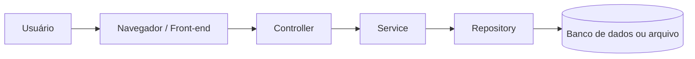

%%[🖋 Edit in Excalidraw](attachments/2026-06-01%20Rev.%20Exce%C3%A7%C3%B5es%20e%20LOGs%202026-06-01%2008.44.14.excalidraw.md)%%

# Fichamento da Aula — 01/06/2026

Disciplina: **APS 2026.1**  
Tema central: **Tratamento de exceções, validação, camadas da aplicação e logging**

---

## 1. Visão Geral da Aula

A aula discutiu o tratamento de erros e exceções em aplicações web, com foco em arquitetura em camadas, validação de dados, regras de negócio, falhas técnicas e uso de logs.

Os principais temas abordados foram:

- diferença entre erro esperado, regra de negócio e exceção;
- validação de entrada no front-end e no back-end;
- tratamento de exceções em Java;
- diferença entre `Exception` e `RuntimeException`;
- encapsulamento de exceções entre camadas;
- uso de logs para depuração e monitoramento;
- riscos de logs mal configurados;
- exemplos equivalentes em Python orientado a objetos.

---

## 2. O Que é uma Exceção?

Em sentido geral, exceção é algo que **foge à regra**.

Na programação, porém, é importante distinguir entre:

- erro esperado no fluxo normal;
- entrada inválida;
- violação de regra de negócio;
- falha técnica;
- bug interno;
- estado inesperado do sistema.

Nem tudo que “dá errado” deve ser tratado da mesma forma.

---

## 3. Erro de Entrada do Usuário

Quando o usuário interage com um sistema, é esperado que ele possa informar dados incorretos.

Exemplos:

- digitar texto em um campo numérico;
- informar CPF com quantidade incorreta de dígitos;
- deixar campo obrigatório vazio;
- digitar idade negativa;
- informar e-mail em formato inválido.

Essas situações não devem ser tratadas inicialmente como falhas inesperadas do sistema. Elas fazem parte do fluxo normal de interação com o usuário.

### Tratamento adequado

O tratamento adequado é fazer validação e orientar o usuário.

Exemplo em JavaScript:

```javascript
const idade = Number(campoIdade.value);

if (Number.isNaN(idade)) {
    mostrarMensagem("A idade deve ser um número.");
} else if (idade < 0) {
    mostrarMensagem("A idade não pode ser negativa.");
} else {
    enviarFormulario();
}
```

Nesse caso, não faz sentido lançar uma exceção técnica para o usuário. O sistema deve validar, informar o problema e permitir a correção.

---

## 4. Validação no Front-end

O front-end é a camada que interage diretamente com o usuário. Por isso, deve validar a entrada antes de enviar os dados ao servidor.

Exemplos de validação no front-end:

- verificar se campos obrigatórios foram preenchidos;
- verificar se valores numéricos são realmente números;
- impedir valores negativos quando não fizerem sentido;
- verificar tamanho de CPF, matrícula ou telefone;
- exibir mensagens claras e amigáveis;
- evitar que dados obviamente inválidos sejam enviados.

### Exemplo

Se o usuário informa a idade `-20`, o front-end deve apresentar uma mensagem como:

> A idade informada é inválida.

Esse é um erro esperado de interação, não um erro interno do sistema.

---

## 5. O Back-end Também Deve Validar

Mesmo que o front-end valide os dados, o back-end não deve confiar totalmente no front-end.

Isso acontece porque:

- o usuário pode desabilitar validações no navegador;
- a API pode ser chamada diretamente por ferramentas externas;
- outro sistema pode consumir a API;
- pode haver bug no front-end;
- pode haver tentativa de burlar a aplicação.

Portanto, validações essenciais devem ser repetidas no servidor.

### Exemplo

Se a API recebe uma idade negativa:

```json
{
  "idade": -20
}
```

O servidor deve rejeitar a requisição com uma resposta adequada, normalmente da família HTTP 400.

Exemplo conceitual:

```http
HTTP/1.1 422 Unprocessable Entity

{
  "mensagem": "A idade informada é inválida."
}
```

Essa situação pode indicar que há um bug no front-end ou uma tentativa de chamada inválida à API, mas não significa necessariamente que a resposta deva ser `500`.

---

## 6. Diferença Entre Validação, Regra de Negócio, Falha Técnica e Bug

Uma das distinções mais importantes da aula é separar diferentes tipos de problema.

| Situação | Exemplo | Onde tratar | Resposta comum |
|---|---|---|---|
| Entrada inválida | idade negativa, CPF incompleto | front-end e back-end | 400 ou 422 |
| Regra de negócio violada | aluno sem pré-requisito | service | 409 ou 422 |
| Falha técnica | arquivo inacessível, banco caiu | repository/service/controller global | 500 |
| Bug interno | `NullPointerException`, índice inválido | log, correção e resposta controlada | 500 |

---

## 7. Entrada Inválida Não é Igual a Erro Interno

É importante não confundir uma requisição inválida com erro interno do servidor.

### Exemplo de requisição inválida

O cliente envia:

```json
{
  "idade": -20
}
```

Possível resposta:

```http
HTTP/1.1 422 Unprocessable Entity
```

ou:

```http
HTTP/1.1 400 Bad Request
```

### Exemplo de erro interno

O sistema tenta salvar dados, mas o banco está indisponível.

Possível resposta:

```http
HTTP/1.1 500 Internal Server Error
```

A diferença é importante:

- `400` ou `422`: problema nos dados enviados ou na regra de negócio;
- `500`: falha interna inesperada no servidor.

---

## 8. Arquitetura Web em Camadas

A aula retomou a arquitetura em camadas usada na aplicação web.

Fluxo geral:



### Front-end

Responsabilidades:

- interagir com o usuário;
- validar dados de entrada;
- exibir mensagens amigáveis;
- enviar requisições ao back-end.

### Controller

Responsabilidades:

- receber requisições HTTP;
- extrair dados da requisição;
- chamar o service;
- converter resultados em respostas HTTP;
- tratar exceções de alto nível;
- escolher status HTTP adequado.

### Service

Responsabilidades:

- concentrar regras da aplicação;
- coordenar operações;
- verificar regras de negócio;
- chamar repositories;
- lançar exceções ou retornar erros de domínio quando necessário.

### Repository

Responsabilidades:

- acessar dados;
- salvar, consultar, alterar e remover informações;
- lidar com detalhes de persistência;
- encapsular falhas específicas de banco, arquivo ou API externa.

---

## 9. Exemplo: Matrícula de Aluno em Disciplina

Foi usado o exemplo de matrícula de um aluno em uma disciplina.

Dados da operação:

- aluno: `123`;
- disciplina: `323`;
- turma: `1`.

O front-end deve garantir que:

- a matrícula é um número;
- o código da disciplina é um número;
- o código da turma é um número;
- os valores são válidos;
- os campos obrigatórios foram preenchidos.

Depois disso, o controller chama o service.

Exemplo conceitual:

```java
service.matricular(alunoId, disciplinaId, turmaId);
```

O service consulta o repository para verificar:

- se o aluno existe;
- se a disciplina existe;
- se a turma existe;
- se o aluno já cursou os pré-requisitos;
- se a matrícula pode ser realizada.

---

## 10. Regra de Negócio: Aluno Sem Pré-requisito

Se o aluno tenta se matricular em uma disciplina sem ter cumprido o pré-requisito, há uma violação de regra de negócio.

Essa situação pode ser modelada de mais de uma forma.

### Opção 1: exceção de domínio

```java
throw new PreRequisitoNaoCumpridoException(
    "Aluno não cumpriu os pré-requisitos da disciplina."
);
```

### Opção 2: retorno de resultado

```java
return ResultadoMatricula.falha(
    "Aluno não cumpriu os pré-requisitos da disciplina."
);
```

As duas abordagens podem ser corretas, dependendo do estilo arquitetural adotado.

O mais importante é não confundir essa situação com falha técnica.

Aluno sem pré-requisito não é o mesmo tipo de problema que banco de dados fora do ar, arquivo inacessível ou bug interno.

---

## 11. Códigos HTTP Relacionados a Erros

A aula mencionou códigos HTTP usados em respostas de erro.

### 400 Bad Request

Indica que a requisição tem problema de formato ou dados inválidos.

Exemplos:

- campo obrigatório ausente;
- dado em formato incorreto;
- parâmetro inválido.

### 403 Forbidden

Indica que o usuário não tem permissão para executar a operação.

Exemplo:

- usuário autenticado tentando acessar recurso que não pode acessar.

### 404 Not Found

Indica que o recurso não foi encontrado.

Exemplos:

- página inexistente;
- rota inexistente;
- entidade não encontrada.

### 409 Conflict

Indica conflito com o estado atual do recurso.

Exemplo:

- tentativa de matrícula que conflita com o estado acadêmico atual do aluno.

### 422 Unprocessable Entity

Indica que a requisição está bem formada, mas contém erro semântico ou violação de regra de negócio.

Exemplo:

- aluno sem pré-requisito;
- idade com valor semanticamente inválido;
- operação não permitida pelas regras da aplicação.

### 500 Internal Server Error

Indica falha interna inesperada.

Exemplos:

- banco de dados indisponível;
- falha não tratada;
- erro de persistência;
- bug interno;
- exceção inesperada.

---

## 12. Exception e RuntimeException em Java

Em Java, há uma distinção importante entre exceções verificadas e não verificadas.

### Exception

Uma `Exception` checked obriga quem chama o método a lidar explicitamente com a exceção.

Isso pode ser feito de duas formas:

1. tratando com `try/catch`;
2. declarando `throws` para propagar a exceção.

Exemplo:

```java
public void carregarArquivo() throws IOException {
    // código que pode lançar IOException
}
```

Quem chama esse método precisa lidar com a possibilidade de erro:

```java
try {
    carregarArquivo();
} catch (IOException e) {
    logger.error("Erro ao carregar arquivo", e);
}
```

Ou propagar:

```java
public void inicializarSistema() throws IOException {
    carregarArquivo();
}
```

### RuntimeException

Uma `RuntimeException` não exige tratamento obrigatório pelo compilador.

Ela é frequentemente usada para:

- bugs;
- estados inválidos;
- argumentos inválidos;
- falhas inesperadas;
- exceções de domínio em alguns projetos;
- falhas de infraestrutura em alguns estilos arquiteturais.

Exemplo:

```java
throw new IllegalArgumentException("Idade inválida: " + idade);
```

---

## 13. Exceções Checked e Unchecked

### Checked exception

Uma checked exception é verificada pelo compilador.

Exemplo:

```java
IOException
FileNotFoundException
SQLException
```

Essas exceções obrigam o programador a decidir o que fazer:

- tratar;
- propagar;
- encapsular em outra exceção.

### Unchecked exception

Uma unchecked exception não é exigida pelo compilador.

Exemplo:

```java
RuntimeException
NullPointerException
IllegalArgumentException
ArrayIndexOutOfBoundsException
```

Essas exceções podem ocorrer em tempo de execução sem obrigação de tratamento explícito.

---

## 14. Metáfora da Construção da Parede

A aula usou uma metáfora para explicar exceções.

Uma pessoa contrata alguém para construir uma parede. Algumas situações podem ser previstas:

- faltar tijolo;
- faltar cimento;
- faltar material.

Essas situações fazem parte do contrato. Quem contratou deve estar preparado para resolvê-las.

Em código, isso se aproxima de uma checked exception.

Exemplo:

```java
public void construirParede(double largura, double altura)
        throws FaltouMaterialException {
    // implementação
}
```

Quem chama precisa tratar:

```java
try {
    pedreiro.construirParede(2, 3);
} catch (FaltouMaterialException e) {
    comprarMaterial();
}
```

Por outro lado, situações inesperadas como terremoto ou carro derrubando a parede não fazem parte do fluxo normal. Elas se aproximam de falhas inesperadas ou `RuntimeException`.

---

## 15. ArrayIndexOutOfBoundsException

A `ArrayIndexOutOfBoundsException` acontece quando o código tenta acessar uma posição inexistente de um array.

Exemplo:

```java
int[] numeros = {1, 2, 3};

System.out.println(numeros[10]);
```

Esse erro normalmente indica bug no código, porque o programador deveria garantir que o índice acessado existe.

---

## 16. NullPointerException

A `NullPointerException` ocorre quando o código tenta acessar atributo ou método de um objeto nulo.

Exemplo:

```java
Usuario usuario = null;

System.out.println(usuario.getNome());
```

Esse erro pode ser simples de identificar quando está próximo da causa, mas pode ser difícil quando o valor nulo foi criado ou gravado em outra parte do sistema.

### Exemplo conceitual

1. Um cadastro grava uma matrícula como `null`.
2. O erro não aparece imediatamente.
3. Em outro momento, uma consulta recupera esse valor.
4. O sistema tenta usar a matrícula.
5. Ocorre `NullPointerException`.

Por isso, a validação e a sanitização de dados são importantes.

---

## 17. IllegalArgumentException

A `IllegalArgumentException` pode ser usada quando um método recebe argumento inválido.

Exemplo:

```java
public void atualizarIdade(int idade) {
    if (idade < 0 || idade > 200) {
        throw new IllegalArgumentException("Idade inválida: " + idade);
    }

    this.idade = idade;
}
```

A ideia é impedir que o método continue executando com dados que não fazem sentido.

Se um método chega a um estado que não deveria ocorrer, ele deve falhar de forma explícita, em vez de esconder o problema.

---

## 18. Não Esconder Bugs

Um princípio reforçado na aula é que bugs não devem ser escondidos.

Esconder bugs significa:

- capturar exceção e não fazer nada;
- retornar sucesso quando a operação falhou;
- substituir erro real por mensagem genérica sem log;
- ignorar estados inválidos;
- permitir que dados inconsistentes sigam pelo sistema.

Exemplo ruim:

```java
try {
    salvarUsuario(usuario);
} catch (Exception e) {
    // ignora o erro
}
```

Exemplo melhor:

```java
try {
    salvarUsuario(usuario);
} catch (Exception e) {
    logger.error("Erro ao salvar usuário", e);
    throw e;
}
```

Em produção, o sistema deve falhar de forma controlada:

- registrar o erro;
- retornar resposta segura;
- não expor detalhes técnicos;
- permitir investigação posterior.

---

## 19. Mensagem Técnica e Mensagem para o Usuário

A mensagem de uma exceção é feita para desenvolvedores, não para usuários finais.

Não é recomendado fazer:

```java
ctx.result(exception.getMessage());
```

### Problemas

Isso pode:

- expor detalhes internos;
- mostrar caminhos de arquivos;
- vazar dados sensíveis;
- apresentar mensagem técnica demais;
- dificultar internacionalização;
- confundir o usuário;
- revelar informações úteis para ataques.

### Separação correta

A aplicação deve separar:

- mensagem técnica: registrada no log;
- mensagem amigável: apresentada ao usuário.

Exemplo:

```java
logger.error("Erro ao cadastrar usuário", exception);

ctx.status(500);
ctx.result("Não foi possível concluir a operação. Tente novamente mais tarde.");
```

---

## 20. Falhas Técnicas em Camadas Mais Baixas

Falhas técnicas podem ocorrer em camadas como repository ou infraestrutura.

Exemplos:

- banco de dados indisponível;
- conexão perdida;
- arquivo apagado;
- permissão negada;
- disco cheio;
- falha de rede;
- serviço externo fora do ar.

Essas falhas devem ser tratadas de forma diferente de erros de validação ou regras de negócio.

---

## 21. FileNotFoundException e IOException

Em Java, ao acessar arquivos, podem ocorrer exceções como:

- `FileNotFoundException`;
- `IOException`.

A `FileNotFoundException` é um tipo de `IOException`.

Operações de entrada e saída são frágeis porque dependem do ambiente externo:

- arquivo pode ser apagado;
- diretório pode não existir;
- permissão pode mudar;
- disco pode encher;
- arquivo pode estar bloqueado.

Por isso, Java obriga o código a considerar muitas dessas falhas usando checked exceptions.

---

## 22. Encapsulamento de Exceções

Encapsular uma exceção significa capturar uma exceção de nível mais baixo e lançar uma nova exceção mais adequada ao nível de abstração atual.

### Problema

Se o repository lança `FileNotFoundException` diretamente para o service, o service passa a conhecer um detalhe de implementação da persistência.

Isso aumenta o acoplamento.

### Solução

O repository captura a exceção técnica e lança uma exceção própria da camada.

Exemplo:

```java
try {
    salvarArquivo();
} catch (IOException e) {
    throw new UsuarioRepositoryException("Erro ao persistir usuário", e);
}
```

Nesse exemplo:

- `IOException` é a causa original;
- `UsuarioRepositoryException` representa a falha no nível do repository;
- a causa original é preservada.

---

## 23. Acoplamento Entre Camadas

Acoplamento é dependência entre partes do sistema.

A arquitetura em camadas busca reduzir acoplamento.

O service não deveria depender de detalhes como:

- se os dados estão em CSV;
- se os dados estão em banco relacional;
- se os dados estão em API externa;
- se a persistência usa arquivo, memória ou outro serviço.

O service deve depender da abstração do repository, não dos detalhes internos da persistência.

---

## 24. Exceções Específicas por Camada

Criar exceções específicas pode ajudar a melhorar a clareza do sistema.

Exemplo no repository:

```java
public class UsuarioRepositoryException extends RuntimeException {
    public UsuarioRepositoryException(String mensagem, Throwable causa) {
        super(mensagem, causa);
    }
}
```

Exemplo no service:

```java
public class UsuarioServiceException extends RuntimeException {
    public UsuarioServiceException(String mensagem, Throwable causa) {
        super(mensagem, causa);
    }
}
```

Uso:

```java
try {
    usuarioRepository.salvar(usuario);
} catch (UsuarioRepositoryException e) {
    throw new UsuarioServiceException("Erro ao cadastrar usuário", e);
}
```

### Cuidado

Não é necessário criar exceção para tudo.

Exceções específicas são úteis quando:

- reduzem acoplamento;
- melhoram a clareza;
- ajudam no tratamento;
- carregam informações relevantes;
- representam conceitos importantes do domínio.

Devem ser evitadas quando geram apenas excesso de classes sem ganho real.

---

## 25. Preservar a Causa Original

Ao encapsular exceções, é importante preservar a causa original.

Exemplo:

```java
throw new UsuarioRepositoryException("Erro ao salvar usuário", e);
```

O parâmetro `e` permite manter o stack trace completo.

Assim, o log consegue mostrar:

- a exceção de alto nível;
- a sequência de chamadas;
- a causa original;
- o ponto exato onde a falha aconteceu.

---

## 26. Stack Trace

Stack trace é a pilha de chamadas registrada quando uma exceção ocorre.

Ele mostra o caminho percorrido pelo código até chegar ao erro.

Exemplo conceitual:

```text
UsuarioRepositoryException: Erro ao salvar usuário
    at UsuarioRepository.salvarTodos(...)
    at UsuarioRepository.salvarUsuario(...)
    at UsuarioService.cadastrarUsuario(...)
    at UsuarioController.cadastrarUsuario(...)

Caused by: FileSystemException: Operation not permitted
```

A parte `Caused by` mostra a causa original da falha.

No exemplo, o erro de alto nível é `UsuarioRepositoryException`, mas a causa real foi uma falha de permissão no sistema de arquivos.

---

## 27. Tratamento Global de Exceções

Em uma aplicação web, é comum configurar tratamento global para exceções não tratadas.

Exemplo conceitual em Javalin:

```java
app.exception(Exception.class, (e, ctx) -> {
    logger.error("Erro não tratado", e);

    ctx.status(500);
    ctx.render("erro500.html");
});
```

Esse tratamento evita que detalhes técnicos sejam exibidos ao usuário e garante que a falha seja registrada.

---

# Logging

---

## 28. O Que é um Log?

Um log é um registro de eventos que acontecem durante a execução de um sistema.

Ele pode registrar:

- início da aplicação;
- encerramento da aplicação;
- requisições recebidas;
- operações realizadas;
- erros;
- alertas;
- falhas de autenticação;
- tentativas inválidas;
- tempo de execução de tarefas;
- chamadas a serviços externos;
- falhas de banco de dados;
- informações úteis para investigação.

Logs são fundamentais para entender o comportamento de um sistema, especialmente quando ele está em produção.

---

## 29. Para Que Servem os Logs?

Logs servem para:

- depurar problemas;
- investigar falhas;
- monitorar comportamento da aplicação;
- auditar eventos importantes;
- detectar erros antes que usuários reclamem;
- acompanhar desempenho;
- entender fluxos de execução;
- identificar causas de falhas;
- apoiar manutenção do sistema.

Sem logs, muitas falhas em produção ficam difíceis de diagnosticar.

---

## 30. Log Não é Apenas Para Erro

Um erro comum é pensar que log serve apenas para registrar falhas.

Logs também registram eventos normais e importantes.

Exemplos:

- aplicação iniciou com sucesso;
- conexão com banco foi estabelecida;
- usuário foi cadastrado;
- tarefa agendada começou;
- tarefa agendada terminou;
- relatório foi gerado;
- integração externa foi chamada.

Esses registros ajudam a entender se o sistema está funcionando como esperado.

---

## 31. Logger

Um logger é o objeto usado pela aplicação para registrar mensagens de log.

Exemplo em Java:

```java
private static final Logger logger = LogManager.getLogger(UsuarioController.class);
```

Exemplo de uso:

```java
logger.info("Usuário cadastrado com sucesso");
logger.warn("Tentativa de cadastro com dados incompletos");
logger.error("Erro ao cadastrar usuário", e);
logger.debug("Dados recebidos para cadastro: nome={}, email={}", nome, email);
```

O logger substitui o uso inadequado de `System.out.println`.

---

## 32. Por Que Evitar System.out.println?

Durante o desenvolvimento, é comum usar:

```java
System.out.println("Valor da variável: " + valor);
```

Problemas dessa prática:

- mistura mensagens de depuração com saída normal;
- não permite controlar níveis de severidade;
- não organiza logs por classe ou módulo;
- não salva adequadamente em arquivo;
- não facilita centralização;
- precisa ser apagado ou comentado depois;
- não é adequado para produção.

Com logger, a mensagem pode permanecer no código e ser ativada ou desativada pela configuração.

Exemplo:

```java
logger.debug("Valor da variável: {}", valor);
```

Se o nível `debug` estiver desativado, essa mensagem não aparece.

---

## 33. Níveis de Log

Os níveis de log classificam a importância ou gravidade da mensagem.

Os níveis apresentados foram:

- `trace`;
- `debug`;
- `info`;
- `warn`;
- `error`;
- `fatal`.

Eles costumam obedecer a uma ordem de severidade:

```text
TRACE < DEBUG < INFO < WARN < ERROR < FATAL
```

---

## 34. TRACE

`trace` é o nível mais detalhado.

Serve para registrar informações muito específicas sobre o fluxo interno do sistema.

Exemplos de uso:

- entrada e saída de métodos;
- etapas internas de um algoritmo;
- detalhes de parsing;
- rastreamento minucioso de uma requisição;
- sequência detalhada de eventos em uma biblioteca.

Exemplo:

```java
logger.trace("Entrando no método calcularMedia com valores={}", valores);
```

### Quando usar

Use `trace` quando for necessário acompanhar um fluxo com muito detalhe.

### Cuidado

`trace` pode gerar volume enorme de log. Normalmente não deve ficar ativado em produção.

---

## 35. DEBUG

`debug` é usado para depuração durante o desenvolvimento ou investigação.

Exemplos:

- valor de variáveis;
- parâmetros recebidos;
- resultado intermediário de uma operação;
- decisão tomada pelo código;
- dados não sensíveis úteis para entender o problema.

Exemplo:

```java
logger.debug("Recebendo dados para cadastro: nome={}, email={}", nome, email);
```

### Quando usar

Use `debug` para mensagens úteis durante desenvolvimento ou análise de problemas.

### Cuidado

Não registrar dados sensíveis, como:

- senha;
- token;
- cartão de crédito;
- chave de API;
- documentos pessoais;
- dados sigilosos.

---

## 36. INFO

`info` registra eventos normais e relevantes da aplicação.

Exemplos:

- aplicação iniciada;
- conexão com banco estabelecida;
- usuário cadastrado;
- arquivo carregado;
- tarefa concluída;
- servidor iniciado;
- configuração importante aplicada.

Exemplo:

```java
logger.info("Aplicação iniciada com sucesso");
logger.info("Usuário cadastrado: id={}", usuarioId);
```

### Quando usar

Use `info` para eventos importantes que ajudam a entender o funcionamento normal do sistema.

### Cuidado

Não registrar informação demais como `info`, para não poluir o log.

---

## 37. WARN

`warn` registra situações de alerta.

São situações que não impedem o sistema de continuar funcionando, mas que merecem atenção.

Exemplos:

- tentativa de login inválida;
- configuração opcional ausente;
- serviço externo demorando muito;
- uso de valor padrão por falta de configuração;
- limite de tentativas próximo do máximo;
- recurso depreciado sendo usado.

Exemplo:

```java
logger.warn("Tentativa de login inválida para email={}", email);
logger.warn("Arquivo de configuração opcional não encontrado. Usando valores padrão.");
```

### Quando usar

Use `warn` quando algo estranho aconteceu, mas a aplicação conseguiu continuar.

---

## 38. ERROR

`error` registra falhas que impediram uma operação de ser concluída.

Exemplos:

- erro ao salvar no banco;
- falha ao acessar arquivo;
- exceção inesperada;
- erro ao processar requisição;
- falha em integração externa obrigatória.

Exemplo:

```java
try {
    usuarioRepository.salvar(usuario);
} catch (UsuarioRepositoryException e) {
    logger.error("Erro ao salvar usuário id={}", usuario.getId(), e);
    throw e;
}
```

### Quando usar

Use `error` quando uma operação falhou e precisa de investigação.

---

## 39. FATAL

`fatal` representa uma falha muito grave, que pode impedir a continuidade da aplicação.

Exemplos:

- aplicação não conseguiu iniciar;
- configuração obrigatória ausente;
- banco principal inacessível na inicialização;
- falha crítica de infraestrutura;
- recurso essencial indisponível.

Exemplo conceitual:

```java
logger.fatal("Não foi possível iniciar a aplicação: configuração obrigatória ausente", e);
```

Nem todas as bibliotecas usam `fatal`. Algumas trabalham apenas até `error`.

---

## 40. Como o Nível Configurado Afeta os Logs

O nível configurado determina quais mensagens aparecem.

Se o nível estiver como `INFO`, aparecem:

- `INFO`;
- `WARN`;
- `ERROR`;
- `FATAL`.

Não aparecem:

- `DEBUG`;
- `TRACE`.

Se o nível estiver como `ERROR`, aparecem:

- `ERROR`;
- `FATAL`.

Se o nível estiver como `DEBUG`, aparecem:

- `DEBUG`;
- `INFO`;
- `WARN`;
- `ERROR`;
- `FATAL`.

Se o nível estiver como `TRACE`, aparecem todos os níveis.

---

## 41. Exemplo de Configuração de Log

Exemplo conceitual com Log4j:

```properties
rootLogger.level = info
rootLogger.appenderRefs = console, file

appender.console.type = Console
appender.console.name = Console
appender.console.layout.type = PatternLayout
appender.console.layout.pattern = %d [%t] %-5level %logger - %msg%n

appender.file.type = File
appender.file.name = File
appender.file.fileName = logs/app.log
appender.file.layout.type = PatternLayout
appender.file.layout.pattern = %d [%t] %-5level %logger - %msg%n
```

Essa configuração indica que os logs serão enviados para:

- console;
- arquivo `logs/app.log`.

---

## 42. Appenders

Appender define o destino dos logs.

Exemplos de destino:

- console;
- arquivo;
- banco de dados;
- servidor centralizado;
- ferramenta de monitoramento;
- serviço de observabilidade.

### Console

Útil durante desenvolvimento.

### Arquivo

Útil para manter histórico local.

### Servidor centralizado

Útil quando há vários sistemas ou vários servidores.

---

## 43. Logs em Arquivo

Salvar logs em arquivo permite investigar problemas depois que eles acontecem.

Exemplo:

```text
logs/app.log
```

Benefícios:

- mantém histórico;
- permite auditoria;
- ajuda na investigação;
- pode ser enviado para ferramentas de monitoramento.

Riscos:

- arquivo pode crescer demais;
- disco pode encher;
- logs antigos podem ocupar espaço;
- dados sensíveis podem ser armazenados indevidamente.

---

## 44. Rotação de Logs

Rotação de logs é uma prática para evitar que um arquivo cresça indefinidamente.

Em vez de manter tudo em um único arquivo, o sistema cria arquivos separados por tamanho ou data.

Exemplo:

```text
app.log
app-2026-06-01.log
app-2026-06-02.log
app-2026-06-03.log
```

Ou:

```text
app.log
app.log.1
app.log.2
app.log.3
```

A rotação ajuda a evitar que o log ocupe todo o disco.

---

## 45. Risco de Log Excessivo em Produção

Configurar `debug` ou `trace` em produção pode gerar volume muito alto de logs.

Consequências possíveis:

- aumento de custo;
- queda de desempenho;
- disco cheio;
- dificuldade de encontrar informações relevantes;
- excesso de ruído;
- vazamento acidental de informações sensíveis.

Por isso, o nível de log em produção deve ser configurado com cuidado.

Em muitos sistemas, usa-se `INFO`, `WARN` ou `ERROR`, dependendo da necessidade.

---

## 46. Logs e Custo

Logs ocupam espaço e podem gerar custo.

O custo pode envolver:

- armazenamento;
- processamento;
- banco de dados;
- ferramentas de monitoramento;
- backup;
- retenção histórica;
- tráfego de rede.

Em sistemas com muitas transações, o volume de logs pode ser muito grande.

Por isso, é importante registrar informações úteis, mas evitar excesso.

---

## 47. Logs Centralizados

Em sistemas com várias aplicações, pode ser difícil acessar logs separados.

Uma estratégia melhor é centralizar os logs.

Cada aplicação envia seus logs para um servidor ou ferramenta central.

Benefícios:

- consulta unificada;
- investigação mais rápida;
- correlação entre sistemas;
- alertas automáticos;
- detecção de erro 500;
- monitoramento em tempo real;
- facilidade para equipes de desenvolvimento e infraestrutura.

---

## 48. Monitoramento e Alertas

Com logs centralizados, é possível criar alertas.

Exemplos:

- notificar a equipe quando houver muitos erros 500;
- avisar quando uma integração externa falhar;
- alertar sobre aumento de tentativas inválidas de login;
- detectar queda de serviço;
- monitorar lentidão.

Isso permite que a equipe identifique problemas rapidamente, às vezes antes que o usuário reclame.

---

## 49. Boas Práticas de Logging

### 49.1 Registrar contexto suficiente

Um bom log deve ajudar a entender o problema.

Exemplo ruim:

```java
logger.error("Erro");
```

Exemplo melhor:

```java
logger.error("Erro ao cadastrar usuário email={}", email, e);
```

### 49.2 Preservar a exceção original

Exemplo ruim:

```java
logger.error("Erro ao salvar usuário: " + e.getMessage());
```

Exemplo melhor:

```java
logger.error("Erro ao salvar usuário", e);
```

Assim, o stack trace é preservado.

### 49.3 Não registrar dados sensíveis

Evite registrar:

- senha;
- token;
- chave de API;
- cartão de crédito;
- dados pessoais desnecessários;
- documentos;
- informações sigilosas.

Exemplo ruim:

```java
logger.debug("Senha recebida: {}", senha);
```

Exemplo melhor:

```java
logger.debug("Senha foi preenchida: {}", senha != null && !senha.isBlank());
```

### 49.4 Usar níveis corretos

Não registrar tudo como `error`.

Não registrar tudo como `info`.

Escolher o nível de acordo com a gravidade e a finalidade da mensagem.

### 49.5 Evitar excesso de logs

Logs demais dificultam a análise.

Registre o que ajuda a entender o comportamento do sistema.

### 49.6 Configurar níveis diferentes por ambiente

Em desenvolvimento:

```text
DEBUG ou TRACE
```

Em produção:

```text
INFO, WARN ou ERROR
```

### 49.7 Usar identificadores úteis

Quando possível, registrar identificadores que ajudem a rastrear problemas.

Exemplos:

- `usuarioId`;
- `pedidoId`;
- `matriculaId`;
- `requestId`;
- `correlationId`.

Exemplo:

```java
logger.info("Iniciando matrícula alunoId={}, disciplinaId={}", alunoId, disciplinaId);
```

### 49.8 Não usar log como substituto de tratamento de erro

Registrar o erro não resolve o erro.

Exemplo incompleto:

```java
catch (Exception e) {
    logger.error("Erro", e);
}
```

Depois de registrar, o código deve decidir se:

- retorna erro;
- relança exceção;
- tenta uma recuperação válida;
- cancela a operação;
- notifica outra camada.

---

# Exemplos em Java

---

## 50. Exemplo de Exceção no Repository

```java
public class UsuarioRepositoryException extends RuntimeException {
    public UsuarioRepositoryException(String mensagem, Throwable causa) {
        super(mensagem, causa);
    }
}
```

Uso:

```java
public void salvar(Usuario usuario) {
    try {
        salvarNoArquivo(usuario);
    } catch (IOException e) {
        throw new UsuarioRepositoryException("Erro ao salvar usuário", e);
    }
}
```

---

## 51. Exemplo de Exceção no Service

```java
public class UsuarioServiceException extends RuntimeException {
    public UsuarioServiceException(String mensagem, Throwable causa) {
        super(mensagem, causa);
    }
}
```

Uso:

```java
public void cadastrar(Usuario usuario) {
    try {
        usuarioRepository.salvar(usuario);
    } catch (UsuarioRepositoryException e) {
        throw new UsuarioServiceException("Erro ao cadastrar usuário", e);
    }
}
```

---

## 52. Exemplo de Controller com Tratamento

```java
public void cadastrarUsuario(Context ctx) {
    try {
        Usuario usuario = ctx.bodyAsClass(Usuario.class);

        usuarioService.cadastrar(usuario);

        ctx.status(201).result("Usuário cadastrado com sucesso.");

    } catch (IllegalArgumentException e) {
        logger.info("Dados inválidos no cadastro de usuário", e);

        ctx.status(422).result("Os dados informados são inválidos.");

    } catch (UsuarioServiceException e) {
        logger.error("Erro técnico ao cadastrar usuário", e);

        ctx.status(500).result("Não foi possível cadastrar o usuário.");
    }
}
```

---

# Exemplos em Python Orientado a Objetos

---

## 53. Tratamento de Exceções em Python

Python não possui checked exceptions como Java.

Isso significa que o compilador não obriga o programador a declarar ou capturar exceções.

Mesmo assim, os conceitos de projeto continuam válidos:

- validar entradas;
- separar regra de negócio de falha técnica;
- criar exceções específicas;
- encapsular exceções de baixo nível;
- preservar a causa original;
- registrar logs;
- não exibir erro técnico ao usuário.

---

## 54. Exceções Personalizadas em Python

```python
class RepositoryError(Exception):
    """Erro genérico da camada de persistência."""
    pass


class UserRepositoryError(RepositoryError):
    """Erro específico ao salvar ou recuperar usuários."""
    pass


class ServiceError(Exception):
    """Erro genérico da camada de serviço."""
    pass


class EnrollmentError(ServiceError):
    """Erro técnico relacionado à matrícula."""
    pass


class PrerequisiteNotMetError(ServiceError):
    """Aluno não cumpriu os pré-requisitos."""
    pass


class InvalidInputError(Exception):
    """Entrada inválida recebida pela aplicação."""
    pass
```

---

## 55. Repository em Python

```python
import json
import logging

logger = logging.getLogger(__name__)


class UserRepository:
    def __init__(self, file_path: str):
        self.file_path = file_path

    def save_user(self, user: dict) -> None:
        try:
            users = self._load_users()
            users.append(user)
            self._save_users(users)

        except OSError as error:
            logger.error(
                "Erro de sistema ao salvar usuário no arquivo %s",
                self.file_path,
                exc_info=error
            )

            raise UserRepositoryError(
                "Erro ao persistir usuário"
            ) from error

    def _load_users(self) -> list[dict]:
        try:
            with open(self.file_path, "r", encoding="utf-8") as file:
                return json.load(file)

        except FileNotFoundError:
            return []

        except OSError as error:
            raise UserRepositoryError(
                "Erro ao carregar usuários"
            ) from error

    def _save_users(self, users: list[dict]) -> None:
        with open(self.file_path, "w", encoding="utf-8") as file:
            json.dump(users, file, ensure_ascii=False, indent=2)
```

### Observação

O trecho:

```python
raise UserRepositoryError("Erro ao persistir usuário") from error
```

preserva a causa original da exceção.

Isso permite que o log mostre a exceção de alto nível e também a falha original, como `PermissionError`, `FileNotFoundError` ou outro erro de sistema.

---

## 56. Service em Python

```python
class EnrollmentService:
    def __init__(self, user_repository: UserRepository):
        self.user_repository = user_repository

    def enroll_student(self, student_id: int, course_id: int, class_id: int) -> None:
        self._validate_ids(student_id, course_id, class_id)

        if not self._student_has_prerequisites(student_id, course_id):
            raise PrerequisiteNotMetError(
                f"Aluno {student_id} não cumpriu os pré-requisitos da disciplina {course_id}"
            )

        try:
            enrollment = {
                "student_id": student_id,
                "course_id": course_id,
                "class_id": class_id
            }

            self.user_repository.save_user(enrollment)

        except UserRepositoryError as error:
            raise EnrollmentError(
                f"Falha técnica ao matricular aluno {student_id}"
            ) from error

    def _validate_ids(self, student_id: int, course_id: int, class_id: int) -> None:
        if student_id <= 0:
            raise InvalidInputError("Identificador do aluno inválido")

        if course_id <= 0:
            raise InvalidInputError("Identificador da disciplina inválido")

        if class_id <= 0:
            raise InvalidInputError("Identificador da turma inválido")

    def _student_has_prerequisites(self, student_id: int, course_id: int) -> bool:
        return False
```

Nesse exemplo:

- `InvalidInputError` representa entrada inválida;
- `PrerequisiteNotMetError` representa violação de regra de negócio;
- `EnrollmentError` representa falha técnica ao realizar a matrícula;
- `UserRepositoryError` representa falha na camada de persistência.

---

## 57. Controller em Python

```python
import logging

logger = logging.getLogger(__name__)


class EnrollmentController:
    def __init__(self, enrollment_service: EnrollmentService):
        self.enrollment_service = enrollment_service

    def enroll(self, request_data: dict) -> dict:
        try:
            student_id = int(request_data["student_id"])
            course_id = int(request_data["course_id"])
            class_id = int(request_data["class_id"])

            self.enrollment_service.enroll_student(
                student_id,
                course_id,
                class_id
            )

            return {
                "status": 201,
                "body": {
                    "message": "Matrícula realizada com sucesso."
                }
            }

        except KeyError as error:
            logger.info("Campo obrigatório ausente: %s", error)

            return {
                "status": 400,
                "body": {
                    "message": "Dados obrigatórios não foram informados."
                }
            }

        except ValueError:
            logger.info("Entrada com formato inválido: %s", request_data)

            return {
                "status": 400,
                "body": {
                    "message": "Os identificadores devem ser numéricos."
                }
            }

        except InvalidInputError as error:
            logger.info("Entrada inválida: %s", error)

            return {
                "status": 422,
                "body": {
                    "message": "Os dados informados são inválidos."
                }
            }

        except PrerequisiteNotMetError:
            return {
                "status": 422,
                "body": {
                    "message": "Não foi possível realizar a matrícula porque os pré-requisitos não foram cumpridos."
                }
            }

        except EnrollmentError as error:
            logger.error("Erro técnico ao realizar matrícula", exc_info=error)

            return {
                "status": 500,
                "body": {
                    "message": "Não foi possível realizar a matrícula por uma falha interna. Tente novamente mais tarde."
                }
            }

        except Exception:
            logger.exception("Erro inesperado não tratado")

            return {
                "status": 500,
                "body": {
                    "message": "Algo deu errado. A equipe técnica foi notificada."
                }
            }
```

---

## 58. Configuração de Log em Python

```python
import logging

logging.basicConfig(
    level=logging.INFO,
    filename="app.log",
    filemode="a",
    format="%(asctime)s - %(levelname)s - %(name)s - %(message)s"
)
```

Durante desenvolvimento, pode-se usar `DEBUG`:

```python
import logging

logging.basicConfig(
    level=logging.DEBUG,
    format="%(asctime)s - %(levelname)s - %(name)s - %(message)s"
)
```

---

## 59. Uso do Exemplo em Python

```python
repository = UserRepository("data/users.json")
service = EnrollmentService(repository)
controller = EnrollmentController(service)

request = {
    "student_id": "123",
    "course_id": "323",
    "class_id": "1"
}

response = controller.enroll(request)

print(response)
```

Possível resposta quando o aluno não cumpriu o pré-requisito:

```python
{
    "status": 422,
    "body": {
        "message": "Não foi possível realizar a matrícula porque os pré-requisitos não foram cumpridos."
    }
}
```

Possível resposta quando ocorre falha técnica:

```python
{
    "status": 500,
    "body": {
        "message": "Não foi possível realizar a matrícula por uma falha interna. Tente novamente mais tarde."
    }
}
```

---

## 60. Exemplo Mais Enxuto em Python

```python
class RepositoryError(Exception):
    pass


class EnrollmentError(Exception):
    pass


class PrerequisiteNotMetError(Exception):
    pass


class EnrollmentRepository:
    def save(self, enrollment):
        try:
            with open("enrollments.csv", "a", encoding="utf-8") as file:
                file.write(str(enrollment) + "\n")
        except OSError as error:
            raise RepositoryError("Erro ao salvar matrícula") from error


class EnrollmentService:
    def __init__(self, repository):
        self.repository = repository

    def enroll(self, student_id, course_id):
        if not self.has_prerequisites(student_id, course_id):
            raise PrerequisiteNotMetError("Pré-requisito não cumprido")

        try:
            self.repository.save({
                "student_id": student_id,
                "course_id": course_id
            })
        except RepositoryError as error:
            raise EnrollmentError("Falha técnica ao realizar matrícula") from error

    def has_prerequisites(self, student_id, course_id):
        return False
```

Esse exemplo mostra a mesma ideia da aula em outra linguagem:

- o repository conhece detalhes de persistência;
- o service conhece regras de negócio;
- exceções técnicas são encapsuladas;
- a causa original é preservada.

---

## 61. Comparação Entre Java e Python

| Conceito | Java | Python |
|---|---|---|
| Checked exception | Existe | Não existe |
| Runtime exception | Existe | Todas são tratadas de forma parecida pelo interpretador |
| Obrigação de `try/catch` | Existe para checked exceptions | Não existe no compilador |
| Exceção personalizada | Classe que herda de `Exception` ou `RuntimeException` | Classe que herda de `Exception` |
| Encapsular causa | Construtor com `Throwable cause` | `raise NovaExcecao(...) from error` |
| Logging | Log4j, SLF4J, java.util.logging | módulo `logging` |

---

# Síntese Conceitual

A aula apresentou tratamento de exceções como parte do projeto de software, não apenas como sintaxe da linguagem.

Os principais pontos são:

- erro de entrada do usuário deve ser tratado como validação;
- o back-end também deve validar dados;
- nem toda entrada inválida deve virar erro 500;
- violação de regra de negócio pode ser exceção de domínio ou retorno de erro;
- falhas técnicas devem ser registradas e tratadas de forma controlada;
- bugs não devem ser escondidos;
- mensagens técnicas não devem ser exibidas diretamente ao usuário;
- exceções devem respeitar o nível de abstração da camada;
- exceções de baixo nível podem ser encapsuladas em exceções de nível mais alto;
- logs são essenciais para depuração, monitoramento e operação;
- logs devem ser úteis, seguros e bem configurados;
- IA pode ajudar na implementação, mas precisa ser orientada por quem entende os conceitos.

---

# Orientações da Aula

- Tratar erros previsíveis de entrada do usuário como validação.
- Validar dados no front-end.
- Validar dados essenciais também no back-end.
- Não confiar apenas na validação do navegador.
- Diferenciar entrada inválida, regra de negócio, falha técnica e bug.
- Não transformar toda falha em erro 500.
- Usar códigos HTTP adequados para cada tipo de erro.
- Não esconder bugs.
- Registrar falhas em logs.
- Não exibir mensagens técnicas de exceção diretamente ao usuário.
- Separar mensagem técnica de mensagem amigável.
- Criar exceções específicas quando elas ajudarem no projeto.
- Encapsular exceções de baixo nível quando elas atravessarem camadas.
- Preservar a causa original da exceção.
- Usar logger em vez de `System.out.println`.
- Usar níveis de log adequados.
- Evitar logs excessivos em produção.
- Não registrar dados sensíveis em logs.
- Experimentar logs na aplicação.
- Implementar tratamento de exceções nas camadas da aplicação.
- Fazer a implementação manualmente pelo menos uma vez antes de delegar totalmente à IA.
- Usar IA como apoio, mas orientar a solução com clareza.

---

# Conceitos para se Aprofundar

- Exceção
- Bug
- Validação de entrada
- Sanitização de dados
- Front-end
- Back-end
- Controller
- Service
- Repository
- Regra de negócio
- Exceção de domínio
- Falha técnica
- Acoplamento
- Abstração
- `Exception`
- `RuntimeException`
- Checked exception
- Unchecked exception
- `ArrayIndexOutOfBoundsException`
- `NullPointerException`
- `IllegalArgumentException`
- `IOException`
- `FileNotFoundException`
- Encapsulamento de exceções
- Causa original da exceção
- Stack trace
- `try/catch`
- `throws`
- Códigos HTTP 400, 403, 404, 409, 422 e 500
- Tratamento global de exceções
- Javalin
- Logger
- Log4j
- Logging
- Níveis de log
- `trace`
- `debug`
- `info`
- `warn`
- `error`
- `fatal`
- Appenders
- Logs em arquivo
- Logs em console
- Rotação de logs
- Logs centralizados
- Monitoramento
- Alertas
- Observabilidade
- Exceções em Python
- `raise ... from error`
- Módulo `logging` em Python
- Uso responsável de IA no desenvolvimento

---

# Questões para Revisão

1. O que é uma exceção?

2. Por que nem todo erro deve ser tratado como exceção?

3. Qual é a diferença entre entrada inválida e falha técnica?

4. Por que erros previsíveis de entrada devem ser tratados como validação?

5. Qual é a responsabilidade do front-end na validação dos dados?

6. Por que o back-end também deve validar os dados?

7. Por que o servidor não deve confiar apenas no front-end?

8. Qual é a diferença entre erro 400, 422 e 500?

9. Quando uma aplicação deve retornar erro 500?

10. Quando uma aplicação pode retornar erro 422?

11. Quando uma aplicação pode retornar erro 409?

12. Quando uma aplicação deve retornar erro 404?

13. Quando uma aplicação deve retornar erro 403?

14. Qual é o papel do controller?

15. Qual é o papel do service?

16. Qual é o papel do repository?

17. No exemplo da matrícula, por que a verificação de pré-requisitos fica no back-end?

18. Aluno sem pré-requisito deve sempre ser tratado como exceção técnica? Explique.

19. O que é uma exceção de domínio?

20. Qual é a diferença entre `Exception` e `RuntimeException` em Java?

21. O que é uma checked exception?

22. O que é uma unchecked exception?

23. Por que `ArrayIndexOutOfBoundsException` geralmente indica bug?

24. Quando ocorre uma `NullPointerException`?

25. Para que serve `IllegalArgumentException`?

26. Por que bugs não devem ser escondidos?

27. O que há de errado em capturar uma exceção e não fazer nada?

28. Por que não se deve exibir `exception.getMessage()` diretamente ao usuário?

29. Qual é a diferença entre mensagem técnica e mensagem amigável?

30. O que significa encapsular uma exceção?

31. Por que uma `FileNotFoundException` não deveria atravessar diretamente todas as camadas da aplicação?

32. O que é acoplamento?

33. Como exceções específicas podem reduzir acoplamento?

34. Por que é importante preservar a causa original da exceção?

35. O que é stack trace?

36. Como o stack trace ajuda na investigação de erros?

37. O que é log?

38. Para que servem os logs?

39. Por que log não serve apenas para erro?

40. O que é um logger?

41. Por que usar logger em vez de `System.out.println`?

42. Qual é a diferença entre `trace`, `debug`, `info`, `warn`, `error` e `fatal`?

43. Quando usar `debug`?

44. Quando usar `info`?

45. Quando usar `warn`?

46. Quando usar `error`?

47. Qual é o risco de usar `trace` em produção?

48. Quais informações não devem ser registradas em logs?

49. O que são appenders?

50. O que é rotação de logs?

51. Por que logs podem gerar custo?

52. O que são logs centralizados?

53. Como logs podem ajudar no monitoramento?

54. Como Python preserva a causa original de uma exceção?

55. Qual é o equivalente em Python ao encapsulamento de exceções feito em Java?

56. Python possui checked exceptions? Explique.

57. Como o módulo `logging` de Python se relaciona com os conceitos vistos na aula?

58. Por que a IA precisa ser orientada ao implementar tratamento de exceções?

59. Que instruções deveriam ser dadas a uma IA para implementar exceções corretamente em uma aplicação em camadas?

60. Por que tratamento de exceções deve ser visto como parte do projeto de software?